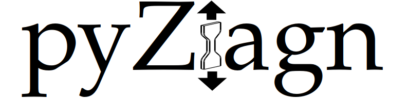

<p align=center></p>

# pyZiagn

**Python librarY for material characteriZation based on experImental dAta for lightweiGht desigN**

**Python-Bibliothek zur Materialcharakterisierung basierend auf experimentellen Daten für den Leichtbau**

**Libreria Python per la caratterizzazione dei materiali sulla base di dati sperimentali per la costruzione leggera**

## Installation
### Prerequisites
Python 3 and you can install the necessary libraries via PIP:
```
pip install scipy
pip install numpy
pip install matplotlib
pip install matplotlib2tikz
pip install pandas
```

### Install
```
python setup.py install
```

### PIP
You can also install pyZiagn via PIP
```
pip install pyZiagn
```

## How to use 
* Step 1: find cut off displacement of F-u curve, if needed (print force-displacement curve to show data graphically)
* Step 2: activate cuting and smoothing and verify smoothed F-u curve is correct (print force-displacement curve with raw and smoothed data)
* Step 3: find proper region for strain0 and strain1 to calculate Young's modulus (and therefore the yield limit)

## Getting started
See iPython notebook under examples. 
